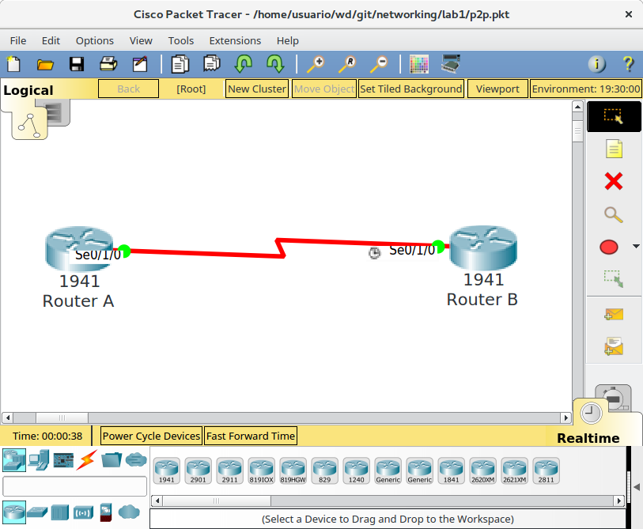

# Networking

## Laboratorio 1 : Construyendo y configurando una red de enlace IPv4

El diseño de una red IPv4, inicia conociendo la cantidad de miembros pertenecientes a la misma (llamados hosts), luego con la selección de un rango apropiado de direcciones IP (existen los rangos de Clase A, B, C, D y E).

El ejemplo más sencillo es una red es del tipo punto a punto, la que cuenta con solo dos miembros y pueden de distintos tipos de clase A, B y C.

La clase D, es para el uso en multicast (un grupo de miembros que tiene asociado una dirección IP) y la clase E, son para fines experimentales.

Red privada | Rango Inicial | Rango Final       | Red punto a punto |
------------|---------------|-------------------|-------------------|
Clase A     | 10.0.0.0/24   | 10.255.255.255/24 | 10.0.0.0/30       |
Clase B     | 172.16.0.0/12 | 172.31.255.255/12 | 172.16.0.0/30     |
Clase C     | 192.168.0.0/8 | 192.168.255.255/8 | 192.168.0.0/30    |


Desarrollando para el caso de un red privada clase A, tenemos dos direcciones de miembros (hosts) y sus correspondientes direcciones de red y de difusión:

* Dirección de red : 10.0.0.0
* Direccion del primer extremo : 10.0.0.1
* Dirección del otro extremo : 10.0.0.2
* Dirección de broadcast : 10.0.0.3

Utilizamos el simulador de red "packetracer", para construir, configurar y probar la red punto a punto clase A.

## Configuración de la direción IP en el Router A
```
enable 
configure terminal
 interface Se0/1/0
  ip address 10.0.0.1 255.255.255.252
  no shutdown
   exit
 exit
write mem
```

## Configuración de la direción IP en el Router B
```
enable 
configure terminal
 interface Se0/1/0
  ip address 10.0.0.2 255.255.255.252
  no shutdown
  exit
 exit
write mem
```
## Gráfica de red privada de punto a punto tipo clase A



Nota: Para diseñar una red de otro tamaño, es necesario conocer el numero de miembros de esta, que sea menor a una potencia de dos. Es decir, el numero de mienbros debe ser menor a 4, 8, 16, etc. Asi mismo, se debe considerar restar 2 para reservar las direcciones de red y de difusión.

## Laboratorio 2 : Agregando una red local IPv4

Continuando con el laboratorio vamos analizar la red local, para esta parte de la red usaremos las direciones de clases C, considerando que tenemos 100 miembros dentro de la red, hacemos corresponder al menor numero que sea potencia de dos (2, 4, 8, ...). Para este ejemplo es 128, pues es el mas cercano al numero 100. Dado que 128 miembros se puede representar con 7 bits en binario.  
Las direcciones privadas de clase C, tiene 24 bits para redes y 8 bits para hosts, dado que solo necesitamos 7 bits de los 8 bits para hosts, el bit restantes ahora formar parte de la direccion de red, o para ser más preciso es parte de la dirección de subred, que ahora tiene 25 bits en luegar de 24 bits y esto se representa, asi:

* Dirección de red (network)          |: 192.168.0.0/25
* Direccion del primer miembro (host) |: 192.168.0.1
* Dirección del ultimo miembro (host) |: 192.168.0.126
* Dirección de difusión (broadcast)   |: 192.168.0.127
